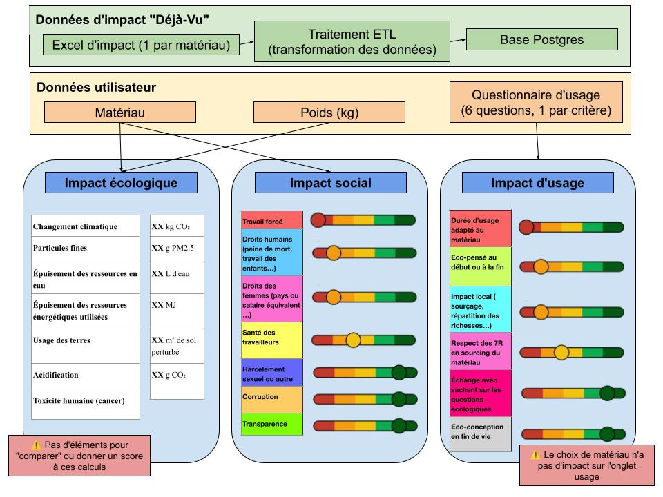

# Exposcore

Ce projet, développé par l'association Déjà Vu, vise à donner une vision d'ensemble des impacts sociaux et environnementaux des matériaux utilisés pour des associations. L'ambition est de sortir du greenwashing de la donnée carbone à tout prix.

L'objectif de cette première itération est de produire un dashboard simple, clé-en-main, qui serve de proof-of-concept (POC) utilisable.

## Spécifications produit

### Utilisateurs

Exposcore est une aide à l'éco-conception à destination de publics variés. Déjà Vu envisage plusieurs niveaux d'utilisation.

#### Niveau 1 — Consultation (version gratuite)

- Données informatives sur les matériaux utilisés. Les informations sont présentées de manière statique, sans fonctionnalités de personnalisation ou de simulation.
- Public : étudiant·es, associations, personnes en recherche d'emploi ou porteur·euses de projets

#### Niveau 2 — Aide à la décision (version de la mission)

- Fonctionnalités dynamiques permettant d'explorer différents choix de matériaux et de paramètres d'usage afin d'orienter les décisions de conception.

- Public : chargé·es d'exposition, graphistes, scénographes, artistes et autres professionnel·les du secteur culturel

#### Niveau 3 — Accompagnement expert

- Expérience entièrement dynamique, enrichie par un accompagnement personnalisé. Les analyses peuvent être adaptées aux spécificités de chaque projet et aux données fournies par les utilisateur·ices.

- Public : structures ayant des besoins plus complexes, telles que les musées, agences, scénographes, graphistes ou artistes travaillant sur des projets d'envergure.

### Fonctionnalités minimales

Possibilité de sélectionner un matériau, donner un poids, remplir des données d'usage et de voir la différence s'afficher à l'écran en niveau d'impact.

Visualisations possibles : graphiques araignées, curseurs "chaud-froid".

### Sources et méthodologie

Cet outil est nourri des recherches sourcées de Déjà Vu qui fournit des scores d'impact économiques et sociaux pour chaque matériau.

### Enjeux techniques

- Trouver un serveur accessible ou gratuit qui n'est pas hébergé sur les GAFAM pour y mettre les données source (serveur Postgres)
- Utiliser un outil open source, accessible ou gratuit pour héberger le dashboard
- Développer une documentation claire pour que le projet puisse être facilement repris

## Proposition / schéma d'exposcore

## Données

On veut prendre en compte les impacts de chaque matériau, sur les plans : écologique, sociaux, usage.
On ignore les onglets : 'Résumé de l’exportation', 'Ecologique - Impacts écologique'.

ATTENTION : on part du principe que les colonnes communes sont fixes d'un sheet à l'autre. On initie avec la première feuille prise
Puis on récupère les données spécifiques matériau par matériau.

### Comparaison écologique
Noms de feuille concernés : 'écologique pour comparaison', 'écoogique Comparaison', 'Impacts pour comparaison',
Colonnes communes : "Catégorie"	"Description de la catégorie"	"Valeur"
Colonnes Matériau : Valeur	Unité	Commentaire	Source	Année

### Impacts sociaux
Noms de feuille : 'Sociaux - Impacts sociaux _ 7 c',
Communes : Catégorie 	Typologie	Critère
Matériau : unité 	description 	Données 	Sources 	Année

### Impacts d'usage
Noms de feuille : 'Usage - Impact d’usage _ 6 caté',
Communes : Catégorie 	Critère 	unité
Matériau : description (juste extraire première ligne pour avoir la durée totale possible d'un matériau)

## Prochaines étapes

L'outil présenté ici est un POC (proof-of-concept). 
Nous avons identifié des étapes souhaitables pour la suite :
- Développer une analyse d'impact pour plusieurs matériaux et données d'entrée (qui aurait en output un rapport ou une visualisation multicritères)
- Développer la possibilité de comparer deux matériaux
- Développer un indicateur composite (type éco-score, ou dépassement de certaines limites) pour faciliter la compréhension de l'impact d'un matériau